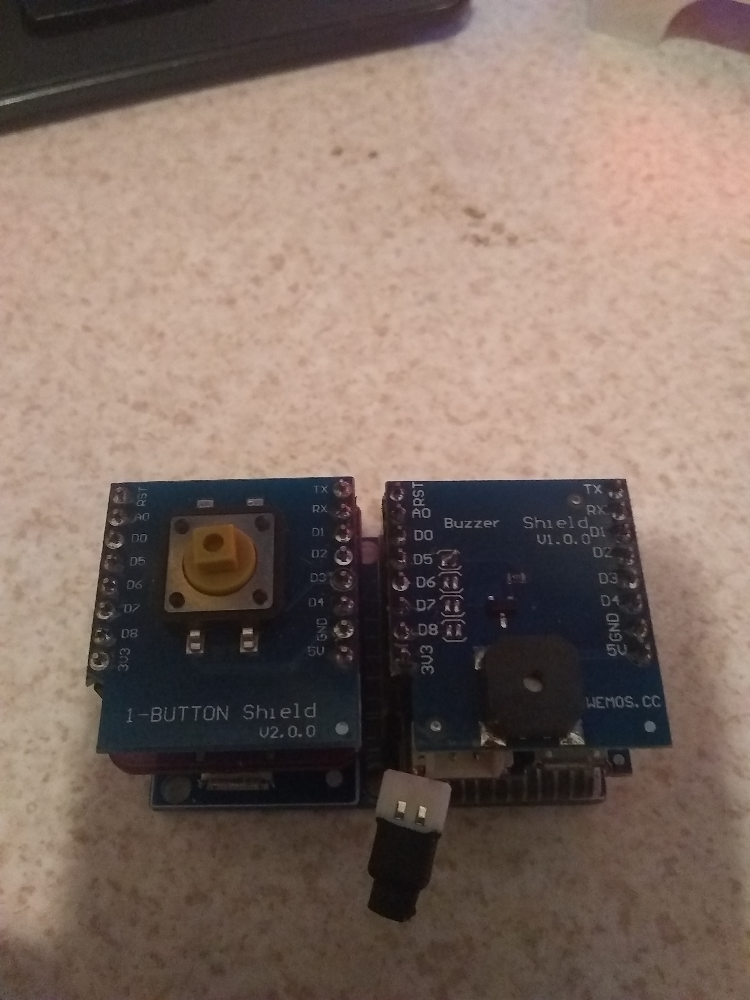
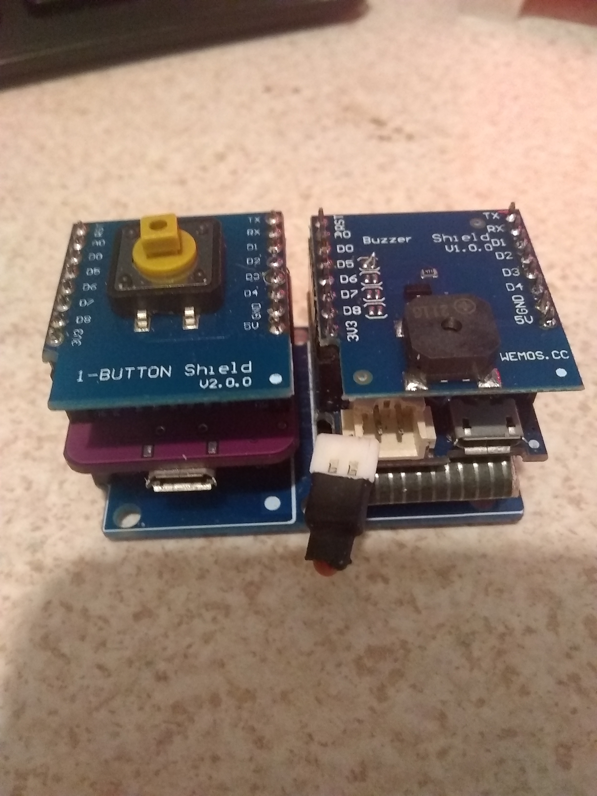

## The Door Bell Example

For the door bell we are using a Wemos D1 Mini, a Button Shield, and a Buzzer shield.  
Optional (sorta), a Lipo Battery and Lipo charging shield.  
If you were to deploy this for a real project you may want to choose a different power source, or batteries that are replacable.  

The operation of the door bell is pretty simple, once setup, the door bell will connect to your MQTT broker, announce that it's online, and wait for the button to be pushed.  

If all goes well, when you hit the button a message will be displayed on your LED matrix.  

IF the batteries die, or power is removed, after a short time, the MQTT Broker will send the  last will and testament message, in this case it's "Door Bell Off Line".  

We are still using the SPIFFS file system, and a config.json file, in this case the file is the same as for the display.  It works more or less the same way.  

The host name is hard written in the code, this probably should be changed.  

# Setup

Like the display, make sure to select a flash size from the tools menu in the IDE, upload the firmware, and update the config.json file.  After a short time you should see that you are online.  

