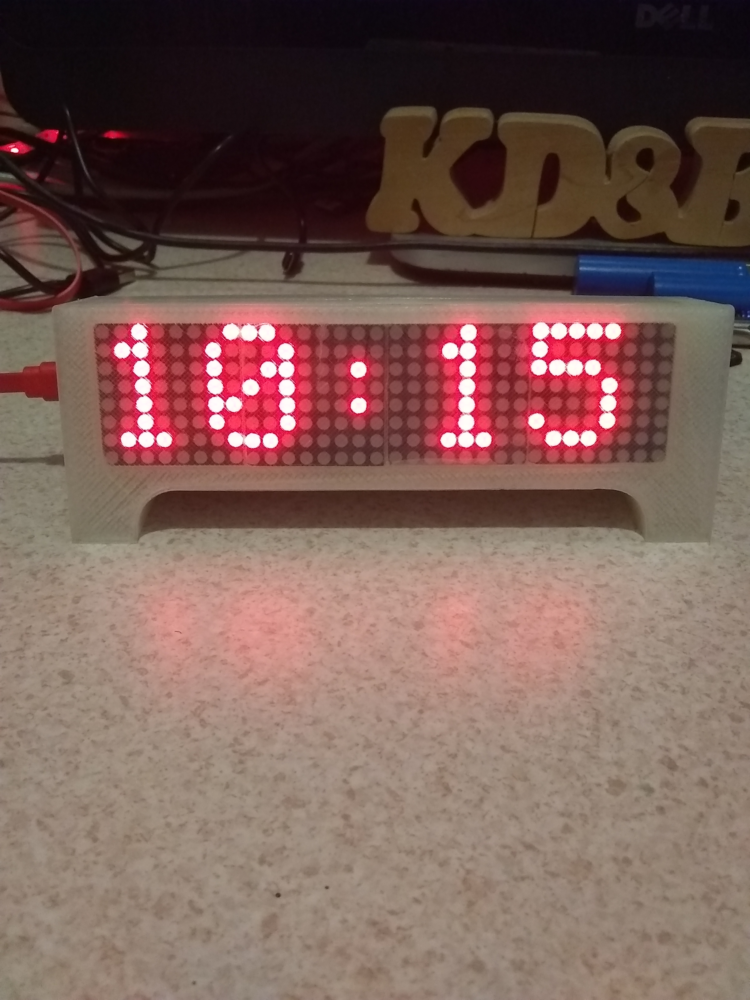

# MQTT D1 Mini LED Matrix Display

June 2019 LeRoy Miller  

    The original sketch was found here:  
    Smarte Display Box by Notagenius  
    https://www.thingiverse.com/thing:3369864/files  
    Which uses a single LED Matrix board, and a ESP8266 (D1 Mini)  
    I was looking for a box that would hold the D1 Mini, and the Wemos  
    LED Matrix shield, which is a small 8x8 matrix that sits on top of  
    the D1 Mini.  The Box didn't work for my needs, but I found the sketch
    would.  
    
    I modified it to use a 32x8 LED Matrix, using google translate  
    translated it to mostly English, Added the WiFiManager so that it  
    is easy to move to different locations.  
    Added Over the Air updates, and a configuration file saved in SPIFFS  
    also added a smile, and sad face, and change how the image is displayed   
    slightly, also added a NTP Clock.   
    Most of these are from the examples in provided by the ESP8266 board core.  
    
    I found this case that works for the 32x8 Matrix and D1 Mini  
    https://www.thingiverse.com/thing:2867294  
    Mine printed a little small, and I needed to sand the LED Matrix to get it to  
    fit, but it's a tight fit, and shouldn't cause a problem.  
    
    Information on setting up SPIFFS can be found here:  
    https://www.youtube.com/watch?v=jIOTzaeh7fs  
    https://github.com/esp8266/arduino-esp8266fs-plugin/releases  
    
    The only line that needs changed in the sketch is for the TIMEOFFSET  
    currently set for Eastern time zone, United State.  
    Setup your config.json file, upload using the information found in the   
    SPIFFS tutorial above.  
    Then upload the sketch to your D1 Mini with a flash size of 4m(3m spiffs)  
    which should be more than needed.  
    Once it's uploaded, you should be able to upload a new config.json and   
    new firmware over the air as/if needed.  
    

## Installation

You can find the source code for this project here:  
[Project source code](https://github.com/automation-technology-club/Yet-Another-MQTT-Demo/tree/master)

## Things To Do

TIMEOFFSET needs to be moved to the config.json file.  
 ** SSID, and Password could also be moved to config.json file and WifiManager could be replaced with a more traditional way to connect to the internet. No plans to do this on my part. **  
Sketch sets up a website, but contains no contain, and isn't used, this could change.  

## Usage

Connects to a MQTT of your choice (see config.json file in the data directory),
and sends status updates to the topic:  
"tele/{mqttname}/POWER"  
it subscribes to the topics:  
"cmnd/{mqttname}/MESSAGE" used to display messages on the screen.
"cmnd/{mqttname}/IMAGE" used to display simple images or images and messages  
        The format for sending a image and a message is:  
            "imagename,this is a message"  
"cmnd/{mqttname}/IMAGE_RAW" which is used to set a binary string to display a image that isn't already in the sketch.  
    example: mosquitto_pub -h broker.hivemq.com -t "cmnd/{mqttname}/IMAGE_RAW" -m "0011110001000010101001011000000110100101100110010100001000111100"  
IMAGE Names:
"home", "bell", "fire", "mail", "wash", "yes", "no", "smile", "sad"  
    example: mosquitto_pub -h broker.hivemq.com -t "cmnd/{mqttname}/IMAGE" -m "mail"  
    or mosquitto_pub -h broker.hivemq.com -t "cmnd/LeRoy/IMAGE" -m "mail,Package at front door"  

## Contributing

1. Fork it!
2. Create your feature branch: `git checkout -b my-new-feature`
3. Commit your changes: `git commit -am 'Add some feature'`
4. Push to the branch: `git push origin my-new-feature`
5. Submit a pull request

## Support Me

If you find this or any of my projects useful or enjoyable please support me.  
Anything I do get goes to buy more parts and make more/better projects.  
https://www.patreon.com/kd8bxp  
https://ko-fi.com/lfmiller  
https://www.paypal.me/KD8BXP  

## Other Projects

https://www.youtube.com/channel/UCP6Vh4hfyJF288MTaRAF36w  
https://kd8bxp.blogspot.com/  

## Credits

Smarte Display Box by Notagenius and others (esp8266 examples)  
I'm only taking credit for expanding on this sketch, not for the sketch.  

## License

This program is free software: you can redistribute it and/or modify
    it under the terms of the GNU General Public License as published by
    the Free Software Foundation, either version 3 of the License, or
    (at your option) any later version.

    This program is distributed in the hope that it will be useful,
    but WITHOUT ANY WARRANTY; without even the implied warranty of
    MERCHANTABILITY or FITNESS FOR A PARTICULAR PURPOSE.  See the
    GNU General Public License for more details.

    You should have received a copy of the GNU General Public License
    along with this program.  If not, see <http://www.gnu.org/licenses>

### version 0.0.1
